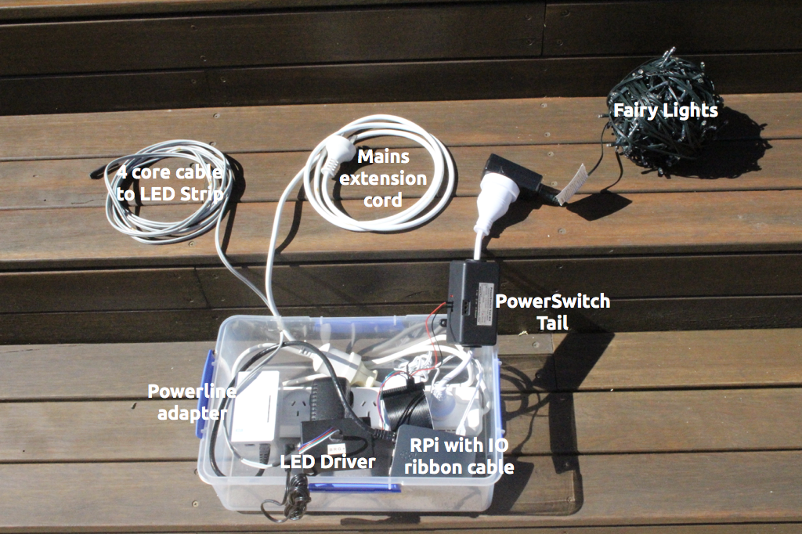

# Super Pi Cheerlights

# About
This project started out two years ago (2015), when I originally attempted it on an Arduino Yún. The code ended up being very messy and unreliable as the Python script running on the Linux side of the Yún couldn't directly access the GPIO and I ended up having to host the web interface on a different server as the processor was just too overloaded. I decided to re-write the whole thing last year (2016) for the Raspberry Pi and meant to release it in time for last Christmas but I kept adding more and more features! So after some further updates for this year (2017), here it is! The Raspberry Pi is both cheaper and more capable, meaning no more external webservers - all the system needs is an internet connection and power.

The main two things Super Pi Cheerlights does is:

* Driving LED strips, optionally on a sunset timer, to display the current [CheerLights](http://cheerlights.com/) colour, or a colour picked on the Web UI
* Acting as a sunset timer(or just remote control) for other fairy lights, christmas lights, etc.

Both of these features are optional and their relevant controls can be hidden (see [settings](#settings)).

A quick rundown of what will happen once you've completed this setup:

* `super-pi-cheerlights.py` will start in the background at boot and takes care of the bulk of the operation. By default, the web UI is fully served from within this file, accessible on port 80(the standard HTTP port) of the Pi.
* `getsun.py` will run at least once a day to load in the current sunset times from the [sunrise-sunset.org](https://sunrise-sunset.org/) API. Success of `getsun.py` symbolised by two green flashes of the LED tape.

The sunset timer fades up the brightness of the LED strips between sunset (when the sun passes below the horizon) and the end of civil twilight (when the center of the sun is more than 6&deg; below the horizon), by which time it is fairly dark. Also at the end of civil twilight, the fairy lights are turned on via a PowerSwitch tail.

At the equator there's approximately 20 mins between sunset and the end of civil twilight. Where I live in Sydney, Australia, there's usually between 25-30 minutes difference. The further you go from the equator, the greater this time.

For those who live greater than around 60&deg; North or South of the equator, you're probably aware that you don't always have the luxury of sunset or twilight, depending on the time of year. If there's no sunset or twilight defined for your location, it'll default to the Unix epoch of 1970 - not particularly useful. As a work around I suggest either changing the latitude in `getsun.py` to be within -60 and 60 or using the [manual time option detailed below](#settings).

* [Software](#software)
  * [Install](#install)
    * [Sun times schedule setup](#sun-times-schedule-setup)
    * [Start on boot](#start-on-boot)
  * [Settings](#settings)
    * [Web UI extra controls](#web-ui-extra-controls)
    * [White balance](#white-balance)
    * [Nginx setup](#nginx-setup)
* [Hardware](#hardware)
  * [Parts List](#parts-list)
  * [LED Strips](#led-strips)
  * [Fairy Lights](#fairy-lights)
* [My setup](#my-setup)

# Software

## Install
```bash
curl -fsSL https://github.com/Tugzrida/super-pi-cheerlights/raw/master/install.sh | bash
```
(as always ***please*** read the contents of one-liner install scripts before running them as ***they have full access to your entire system***)

You should now have a clone of this repo at `/home/pi/super-pi-cheerlights/` and all dependencies should be installed.

### Sun times schedule setup
The options in `getsun.py` need to be set or your setup will not work:

* `lat`, `lon`: the decimal-degrees coordinates of the location to load sun times for from the [sunrise-sunset.org](https://sunrise-sunset.org/) API. Use [gps-coordinates.net](https://www.gps-coordinates.net/) to find your coordinates.
* `timezone`: the timezone where the installation is located. You can list all possible timezones by executing `/home/pi/super-pi-cheerlights/list_tz.py`
* `off*`: hour, minute and second in 24-hour time of when you want the system to turn off
* `offday`: must be 0 if off time is before midnight, 1 if off time is at or after midnight
* `manualstart`: If you don't want the system to use the sun times(or live somewhere that doesn't have sunset and twilight), set this to True and specify the times you wish to use for sunset and twilight in the following options, in the same way as the off time.
* `mansunset*`, `mantwilight*`: same as `off*` for the respective timepoints. Only applies if you set manualstart to True

Run `crontab -e` and add the following line to the end:
```
0 11-13 * * * /home/pi/super-pi-cheerlights/getsun.py
```
This runs `getsun.py` at 11am, 12pm and 1pm everyday for redundancy in case of an internet or power outage. If the Pi misses all three, you can easily run `getsun.py` manually from the web UI or CLI.

Now run `/home/pi/super-pi-cheerlights/getsun.py` to initially create `sunset.json`

### Start on boot
The main file, `super-pi-cheerlights.py`, can be started on boot with systemd.

Firstly, copy `super-pi-cheerlights.service` to `/etc/systemd/system/`:
```bash
sudo cp /home/pi/super-pi-cheerlights/super-pi-cheerlights.service /etc/systemd/system/
```

Then set permissions:
```bash
sudo chown root:root /etc/systemd/system/super-pi-cheerlights.service
sudo chmod 644 /etc/systemd/system/super-pi-cheerlights.service
```

Then finish installing and start the service:
```bash
sudo systemctl daemon-reload
sudo systemctl enable super-pi-cheerlights
sudo systemctl start super-pi-cheerlights
```

The service can be controlled as follows. **For any changes to `super-pi-cheerlights.py` to take effect, the service must be restarted.**
```bash
sudo systemctl start super-pi-cheerlights
sudo systemctl stop super-pi-cheerlights
sudo systemctl restart super-pi-cheerlights
```

## Settings
The following settings are available at the top of the respective files:

`super-pi-cheerlights.py`:

* `builtin_server`: determines whether to use bottlepy to serve static files or an external server such as nginx. See below for details.
* `max_red`, `max_grn`, `max_blu`: sets the maximum value of each colour to correct for white balance. See instructions below.
* `rgb_list`: can be used to adjust individual colours for your specific application. Follow the same steps as for white balance below.


`www/index.html`:

* `show_cheerlights`: show controls for cheerlights/led tape operation
* `show_fairylights`: show controls for fairylights/powerswitch tail operation

### Web UI extra controls
Clicking on "Control" in the title of the Web UI will open a popup with buttons to run `getsun.py` and shutdown the Pi.

When the sunset times have been reloaded successfully, the LED tape will flash green briefly. When the Pi is shutdown, the tape will turn red before eventually turning off.

Either or both of these controls can be disabled by simply commenting out the bottle routes for `/do/reloadsun` or `/do/shutdown` in `super-pi-cheerlights.py`

### White balance
With most LED strips, providing the same voltage to the red, green and blue inputs will not result in perfect white. In order to compensate for this, the maximum values of the red, green and blue outputs on the Pi can be individually adjusted.

To correct for white balance, set `max_red`, `max_grn` and `max_blu` to 100 in super-pi-cheerlights.py (see [settings](#settings)), then use the Web UI to enter manual colour mode.

You can use then use the `/do/set/tapeColour/RED_VAL/GRN_VAL/BLU_VAL` API endpoint on the Pi to tweak the red, green and blue values to make perfect white. Try to keep the values closer to 100 as setting them too low will result in a very dim strip. Then set these values to the max variables in `super-pi-cheerlights.py`

### Nginx setup
The server built into bottle is designed for development only and is therefore not very powerful by itself. If this is causing considerable lag on the Web UI, then you can use nginx as a front end server to take some of the load off bottle. 

Start by stopping super-pi-cheerlights to free up port 80 (`sudo systemctl stop super-pi-cheerlights`) then install nginx with `sudo apt-get -y install nginx`

Now, remove the `default` site with `sudo rm /etc/nginx/sites-enabled/default`

Then install the `super-pi-cheerlights` site:
```bash
sudo cp /home/pi/super-pi-cheerlights/super-pi-cheerlights.nginx.conf /etc/nginx/sites-available/
sudo ln -s /etc/nginx/sites-available/super-pi-cheerlights.nginx.conf /etc/nginx/sites-enabled/
```
You can verify your changes with `sudo nginx -t`

Make sure `builtin_server` in `super-pi-cheerlights.py` is set to `False` (see [settings](#settings)), then restart it with `sudo systemctl restart super-pi-cheerlights`

Then restart nginx with `sudo systemctl restart nginx`

# Hardware

## Parts List
* Raspberry Pi (most versions should work) with internet connection and SD card flashed with Raspbian
* Raspberry Pi Power Supply
### LED Strips
* Whatever length of non-addressable common-positive RGB LED Strip you require (waterproof if outside)
* 12V DC power supply (The LED strips generally use around a maximum of 1 amp per metre at full brightness. You can get by with supplying less current, they just won't be as bright)
* 3&times; 1k&ohm; resistors
* 3&times; TIP31 transistors
* Solderless breadboard (Alternatively, the circuit can be soldered permanently onto copper strip board)
* Jumper wires
### Fairy Lights
* PowerSwitch Tail in the appropriate voltage for your country
* Whatever lights you wish to control (check you don't overload the current rating of your PowerSwitch Tail)
* Jumper wires

## LED Strips
This setup uses non-addressable, common positive (AKA common anode) RGB LED strips, which are usually available with a waterproof silicone coating if required. Common positive strips have one positive connection and three negative connections, for red, green and blue.

The Pi cannot provide enough current or voltage from its GPIO pins to power the LED strips directly, so we need to make a driver circuit, which uses a 12V power supply and three TIP31 transistors to step-up the voltage and current of the PWM signals from the Pi.

Make magazine has a [video detailing how to set this up on a breadboard](https://www.youtube.com/embed/Hn9KfJQWqgI?start=50&end=190), which I suggest watching (note the pins in this diagram are different as we are using a Pi not an Arduino).


If you're more experienced at electronics, this circuit can easily be permanently soldered onto stripboard.

## Fairy Lights
I used a [PowerSwitch Tail](http://www.powerswitchtail.com/) to control power to the fairy lights. PowerSwitch tails can be connected inline with an AC mains lead and allow the AC supply to be turned on and off safely using a simple logic signal.

The PowerSwitch Tail should be connected to pin 12(+) and 14(-) of the Pi.

PowerSwitch Tails can be bought directly from [their website](http://www.powerswitchtail.com/), or from most DIY electronics distributors. Ensure the version you buy is made for the mains voltage in your country as there are 120V and 240V versions.

Most electronics projects(including this one) use a normally open tail, meaning when a logic high is given, the tail switches on(closes). If you happen to have a normally closed tail(the opposite), you'll just need to swap `True` for `False` and vice versa for the IO calls to pin 12 in `super-pi-cheerlights.py` Also make sure you're buying a PowerSwitch tail and not a PowerSSR, ZeroCross or PowerState tail.

The 240V tail can only be bought as a kit of components requiring assembly, which requires basic soldering skills.

**If you aren't confident and somewhat competent at assembling mains voltage components, please seek help from someone who is.**

The 240V version also requires you to pick a control voltage range during assembly. As the Raspberry Pi uses 3.3V logic, the 3-5V range is required.

# My setup
For my own setup (pictured below), I chose to enclose all the components into a plastic box to be stored under the deck where the installation is. The cables enter through a hole in the side which has a slot cut through the rim of the box. Once it's setup and working, I seal this with tape.



Entering the box is a short mains extension cord from an outdoor powerpoint to power a power strip inside the box.

Plugged into the strip is:

* A Powerline adapter to provide network connectivity to the Pi and any devices on the deck. My WiFi is a bit flaky from outside so this ensures the Pi can reliably connect and I can stream music over WiFi to my amp inside which has a 'B' channel onto the deck.
* A 12VDC 2.5A power supply for the LED strips. This is quite underrated for my ~7.5 metres of LEDs but it was the highest capacity one I could find before they started getting too physically big and expensive. Also my LED strips are only fairly cheap ones from eBay so I don't think it's much of an issue.
* A stock RPi power supply
* A PowerSwitch Tail 240V which powers some warm white fairy lights from ALDI

The Pi's GPIO is broken out on a ribbon cable, mainly for ease of access inside the container. The tail and LED driver are connected to this.

I soldered up the LED driver and mounted it inside a project box with a DC jack on one side, jumper wires coming out of the other to connect to the Pi, and a pin header on the top, which connects to a 4 core extension cable I made to connect to the LED strip. Note that the pitch of the pin headers of most LED strips is smaller than standard breadboard spacing and so I needed to use the pin headers supplied with the strips.


